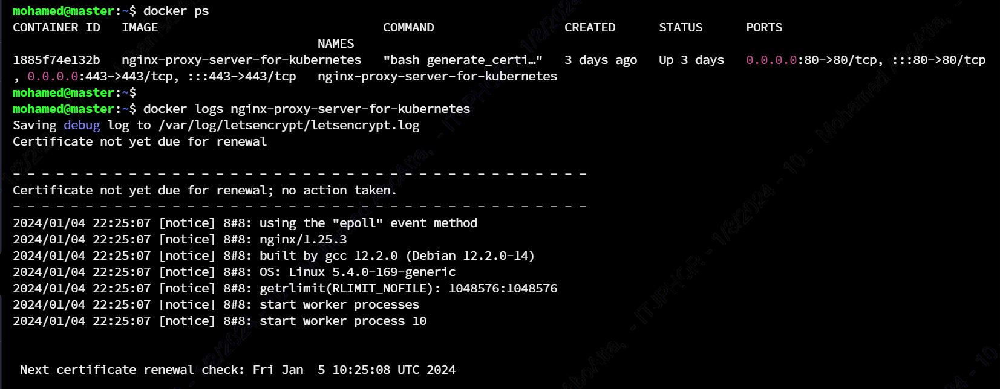

[![LinkedIn][linkedin-shield]][linkedin-url]

<!-- PROJECT LOGO -->
 

  
  <h3 align="center">Nginx Proxy Server for Kubernetes</h3>

<!-- TABLE OF CONTENTS -->

  
Table of Contents

  <ol>
    <li>
      <a href="#about-the-project">About The Project</a>
    </li>
    <li><a href="#business-case">Description</a></li>
    <li><a href="#contact">Contact</a></li>
  </ol>

<!-- ABOUT THE PROJECT -->
## About The Project

* Project Name: Nginx Proxy Server for Kubernetes
* Version: v1.0.0
* Organization Department: Technology

## Description
This project is an Nginx container that acts as a reverse proxy for a Kuberentes cluster. It forwards all HTTP and HTTPs traffic to the Ingress Nginx server in the cluster. The container also takes a list of the used domains in the bash script `generate_certificate.sh` then generate an SSL traffic for the required domain using Let's Encrypt. It also runs every 12 hours to renew the certificate if it's expiring soon.

(<a href="#readme-top">back to top</a>)

<!-- CONTACT -->
## Contact

Mohamed AbdelGawad Ibrahim - [@m-abdelgawad](https://www.linkedin.com/in/m-abdelgawad/) - <a href="tel:+201069052620">+201069052620</a>

(<a href="#readme-top">back to top</a>)

<!-- MARKDOWN LINKS & IMAGES -->
<!-- https://www.markdownguide.org/basic-syntax/#reference-style-links -->
[linkedin-shield]: https://img.shields.io/badge/-LinkedIn-black.svg?style=for-the-badge&logo=linkedin&colorB=555
[linkedin-url]: https://www.linkedin.com/in/m-abdelgawad/
